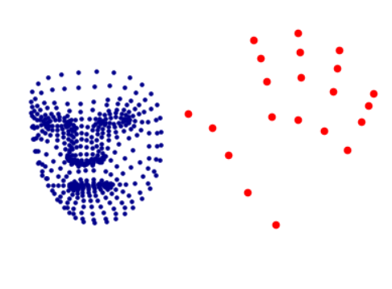
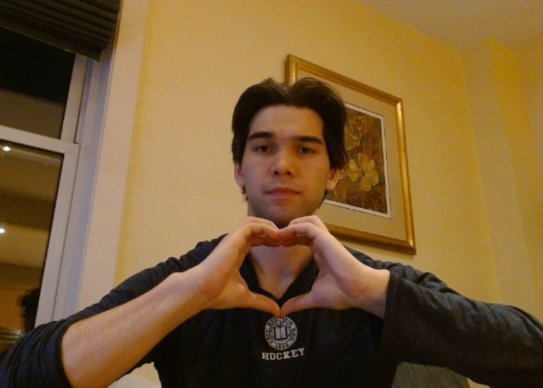
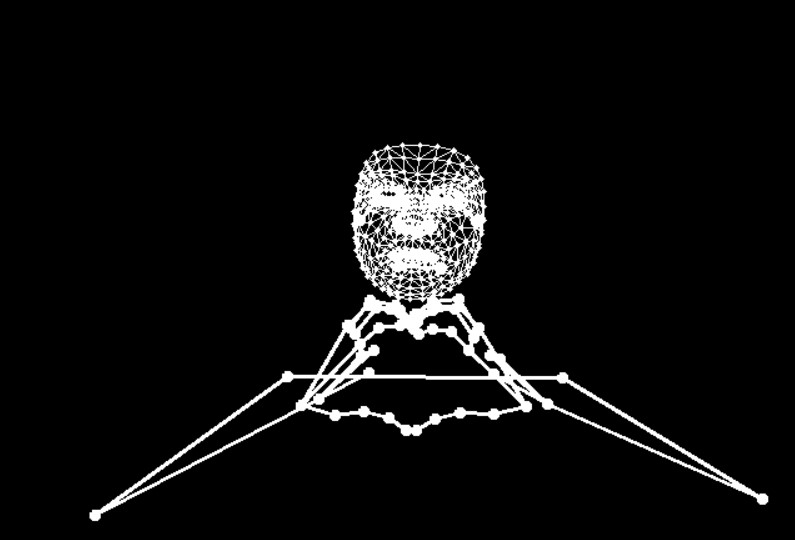

# ActionRecognition

### Research Aim:

Action recognition is the process of interpreting human motion using computer vision. Use cases for the technology is broad with applications across, but not limited to, security systems, human-computer interactions, human behavior analysis, and entertainment and gaming. 

With the rise of large language models, this project focuses on creating a deep learning model to identify human gestures to further develop human-computer interactions. As a large portion of communication is non-verbal, having a model to identify a person's non-verbal communication is important to develop systems which can fully assess all aspects of an interaction before responding. This will allow for more personalised and precise communication between AI models and humans. 

The select actions were chosen due to their distinct and clear motions, and unambiguous meanings. These actions formed a strong baseline model with an overall precision and recall of 97%+ on both the test and train data. The structure laid out in this project provides a framework to easily collect additional data and continually add more actions to future models. The six actions included in the current algorithm are:

1) Wave
2) Kiss
3) Heart
4) Finger
5) Salute 
6) Idle

To showcase the algorithm, the "main.py" script is utilized as a backend to generate and send user location and action data to a Unity program. The data flowing into Unity then controls the location and behaviour of an animated 3D character, which is programmed to respond to each action performed. If you would like to see a demonstration please reach out to me at lmoorfieldyee@gmail.com.

### Project Methodology:
The project is divided into 5 parts; data collection, data pre-processing, exploratory data analysis, model training and evaluation, and model deployment. The project is structured in such a way that additional data for both existing actions and new actions can be collected, ingested, stored, and integrated into the model on an ongoing basis. Below is a step-by-step guide on how the project was run. If you want to replicate my results then please download my processed data, which can be found here, and skip to step #3. Alternatively, you can simply fork this repo and run the main.py file to test the model out in real time. Please note that the data collection and pre-processing is done via scripts at the command line, while EDA and model training is done in Jupyter Notebooks. 

**Steps**

- Raw_Data
1. **Raw Data Collection**: To collect training video samples, the "collect_raw_video.py" script is run. This will prompt you to enter the name of the subject performing the action, describe how the subject is performing the action (standing, sitting, etc.), and which action is being performed. The script will then create the directory structure to store the new data, proceed to collect the video samples of the action being performed (a video capture display will appear to track the start and end of each video sample), and save each video sample as a series of numpy arrays. If you want to collect your own data, you should aim to collect as much data for each action as possible, ensuring to vary your location in the frame and how you perform the gesture. The more variation the model sees, the more robust it will be for new unseen data. As a benchmark, the final model in this project was trained on 1260 total videos (210 videos per class) and produced good results. An example of the raw data directory structure after this step is below:
     - Liam_standing (subject_name + description)
        - Heart (action being performed)
            - Video_sample_0
                - video_frame_0
                - video_frame_1
                - ...
                - video_frame_39
            - ...
            - Video_sample_29
        - Salute (action being performed)
            - Video_sample_0
            - ...
            - Video_sample_29
        - ...
        - Wave
    - Liam_sitting 
        - Heart (action being performed)
        - ...
        - Wave
    - Etc.

2. **Data Processing**: The next step is to process the video data from the "Raw_Data" directory using Google MediaPipe's Holistic model by running the "process_raw_data.py" script. By leveraging Google's Holistic model, it is quick and easy to identify if a human is in the frame and extract various landmarks from their body to track body part positions. It is these landmarks which will be used to train our models. There are 543 landmarks collected for each frame, and each landmark extracted contains a corresponding x, y, & z value, with a visibility value included for the general pose landmarks. Taking into account each x, y, z, & visibility (for pose landmarks only) values for each landmark, there are 1662 data points generated for each frame. The landmark data for each video frame is then flattened, concatenated, and saved as a numpy array in the "Processed_Data" directory. A summary of all the landmarks collected are below:

   - Number of Pose landmarks = 33 (each with an x, y, z & visibility value) = 132 data points
   - Number of Face Landmarks = 468 (each with an x, y, z value) = 1404 data points
   - Left Hand Landmarks = 21 (each with an x, y, z value) = 63 data points
   - Right Hand Landmarks = 21 (each with an x, y, z value) = 63 data points

IMAGE BEFORE PROCESSING

IMAGE POST PROCESSING

3. **EDA & Data Wrangling:** After the raw data pre-processing, the "Data Wrangling and EDA" notebook is used to re-format the data for exploration. After EDA is complete, the landmark data is broken up into their individual groups (as seen above) and saved for model training (in "Modelling_Data" folder).
4. **Modelling and Evaluation:** The final stage before deployment is to actually train a model! The "Modelling and Evaluation" notebook trains multiple Long Short-Term Memory (LSTM) Neural Networks on different variations of landmark data. The notebook constantly updates and saves the best weights for each model as training epochs progress. From here, the best models are evaluated and compared, with the best model(s) being deployed.
5. **Deployment:** After evaluating models in terms of validation loss, accuracy, precision, and recall, the top model is deployed in the simple "main.py" script. This application collects video data in real time and makes prediction on what action is taking place. The application will only start to collect videos when your hand(s) come above your elbow(s), as this marks the start of an action. To make a prediction the model requires 40 frames of data, which usually takes longer to collect than it does to actually perform the action, so make sure to perform gestures slowly (especially for the salute and kiss).

### Project Organization
Project has the below structure.

- functions:
    - keypoints.py   # Holds the Google MediaPipe class
    - makedir.py     # Function to create data directory structure for data collection

- Models:             # Folder storing best models during training
- Modelling_Data:     # Folder holding data used in training
- Processed_Data:     # Folder holding processed data for EDA
- Raw_Data:           # Folder holding raw video data
- Notebooks:
  - Data Wrangling and EDA.ipynb     # EDA notebook
  - Modelling and Evaluation.ipynb   # Modelling notebook
- Scripts:
  - collect_raw_video.py    # script to collect raw video
  - process_raw_data.py     # script to process raw video
  - view_data.py            # script to view raw data video
  - main.py                 # real time detection script